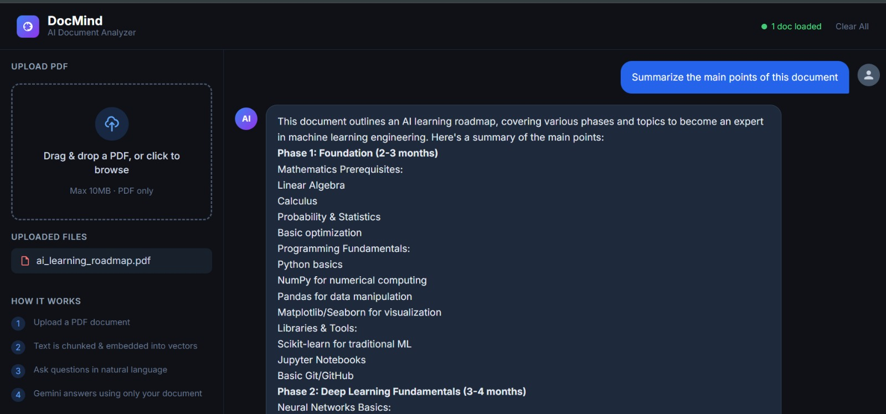

# 🧠 DocMind — AI-Powered Document Analyzer

> Upload any PDF and have a conversation with it using AI. Get instant, accurate answers grounded strictly in your document.



---

## 🚀 Live Demo

> Upload a PDF → Ask anything → Get AI-powered answers with source citations

---

## 📌 Overview

DocMind is a full-stack **RAG (Retrieval Augmented Generation)** application that allows users to upload PDF documents and ask natural language questions about them. Unlike general-purpose chatbots, DocMind answers **strictly from your uploaded document** — no hallucinations, no guessing.

Built as a showcase of combining **AI/ML engineering** with **modern frontend development**.

---

## ✨ Features

- 📄 **PDF Upload** — Drag & drop or click to upload any PDF (up to 10MB)
- 🤖 **AI-Powered Q&A** — Ask questions in plain English, get accurate answers
- 🔍 **Source Citations** — See exactly which chunks of the document the answer came from
- 💬 **Chat History** — Follow-up questions work with full conversation context
- 📚 **Multi-Document Support** — Upload multiple PDFs and query across all of them
- ⚡ **Real-time Responses** — Fast answers powered by Llama 3.1 via Groq

---

## 🏗️ Architecture

```
User uploads PDF
      ↓
FastAPI receives file
      ↓
PyPDF2 extracts text
      ↓
LangChain splits text into chunks (1000 chars, 200 overlap)
      ↓
sentence-transformers converts chunks → vectors (runs locally)
      ↓
FAISS stores vectors in memory

─── User asks a question ───
      ↓
Question → converted to vector
      ↓
FAISS finds top-4 most similar chunks (cosine similarity)
      ↓
Chunks + Question sent to Llama 3.1 (Groq) as context
      ↓
LLM generates grounded answer
      ↓
Answer + source chunks returned to Angular UI
```

---

## 🛠️ Tech Stack

### Backend
| Technology | Purpose |
|-----------|---------|
| Python 3.13 | Core language |
| FastAPI | REST API framework |
| LangChain | RAG pipeline orchestration |
| FAISS | Vector similarity search |
| sentence-transformers | Local text embeddings (all-MiniLM-L6-v2) |
| Groq API (Llama 3.1) | LLM for answer generation |
| PyPDF2 | PDF text extraction |

### Frontend
| Technology | Purpose |
|-----------|---------|
| Angular 17 | Frontend framework (standalone components) |
| Tailwind CSS | Utility-first styling |
| TypeScript | Type-safe development |
| Angular HttpClient | API communication |

---


---

## ⚙️ Setup & Installation

### Prerequisites
- Python 3.9+
- Node.js 18+
- Free Groq API Key → [console.groq.com](https://console.groq.com)

### Backend

```bash
cd backend

# Create virtual environment
python -m venv venv
source venv/bin/activate        # Mac/Linux
venv\Scripts\activate           # Windows

# Install dependencies
pip install -r requirements.txt

# Configure environment
cp .env.example .env
# Add your GROQ_API_KEY inside .env

# Start server
python main.py
# Runs at http://localhost:8000
# Swagger docs at http://localhost:8000/docs
```

### Frontend

```bash
cd frontend

npm install
npm start
# Runs at http://localhost:4200
```

---

## 🔑 API Endpoints

| Method | Endpoint | Description |
|--------|----------|-------------|
| GET | `/` | Health check |
| GET | `/health` | Status + loaded documents |
| POST | `/upload` | Upload & process a PDF |
| POST | `/query` | Ask a question |
| GET | `/documents` | List uploaded documents |
| DELETE | `/reset` | Clear all documents + history |

---

## 🧠 Key ML/AI Concepts Used

**RAG (Retrieval Augmented Generation)**
Grounds LLM answers in real document content, preventing hallucinations. The model can only answer from what's in your PDF.

**Vector Embeddings**
Text is converted to high-dimensional vectors using `sentence-transformers/all-MiniLM-L6-v2`. Similar text produces similar vectors, enabling semantic (meaning-based) search.

**FAISS Vector Search**
Facebook AI Similarity Search — finds the most semantically relevant document chunks for any given question using cosine similarity in milliseconds.

**Text Chunking with Overlap**
PDFs are split into 1000-character chunks with 200-character overlap. The overlap ensures no important information is lost at chunk boundaries.

---


---

## 👨‍💻 Author

Built as a portfolio project to demonstrate full-stack AI application development — combining RAG pipeline engineering with modern Angular frontend development.

---

